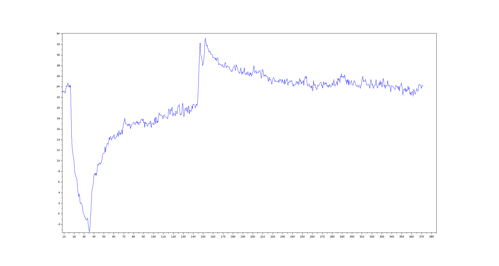

# CH32V003's internal temperature sensor

The CH32V003 has no internal temperature sensor... Is what the datasheet says. Physics says something different. I used the internal RC-oscillators and their different temperature behaviour to measure the temperature of the chip.

## Idea

I want to make a temperature sensor with only internal peripherals in the '003. It is a very capable chip for its 10ct price tag and I want to get everything out of the hardware. My thought is, if I am able to measure the LSI relative to the HSI, I can get a temperature dependent mesurement. To do so, I'll have to find a way to measure the LSI frequency.

## First attempt

The LSI is not densly connected to the peripherals. The only LSI inputs, mentioned in the reference manual, are the independant watchdog, gpios (labeled as "to gpio(internal,to time)") and the PWR module. The independant watchdog is not usable because it's only function is to reset the mcu when not fed. 

My first attempt was to use the TIM1timer in external clock mode 1. In this mode, the timer would get an alternative clock source and just count the pulses, Unfortunately, I didn't find any possibility to use LSI as the clock input. There is a remap option (TIM1_IREMAP) that I thought would  map the LSI to the TIM1 input, but even when it is set, the clock input is still the GPIO. It would have been neat to directly measure the LSI clock, because I could change the sampling time by just reading the counter in different intervals.

## Using the AWU

The next option is the AWU, which is the automatic wake-up uint. It uses the LSI, a prescalar and an internal 6 bit counter to wake the mcu from standby (and also from regular sleep) after a preset amount of time. Just going to sleep and measuring the time until wake-up once wouldn't do, because 64 clock cycles of the LSI would never be enought to get usable values. So I implemented a routine that would sleep 8 times, measure the time and repeat the measurement for a configurable number of times. The average time was measured and voila, it is actually temperature dependent!

## Converting the time to temperature

By cooling the MCU down and just logging the raw values, it was easy to see that we actually measure the temperature. Now we just need to convert the raw timing data to a temperature  value. I have a thermometer on my desk which shows 22 deg c. This gave me an ambient reading of T(22)=19580 timer ticks per iteration. Then I put an ice-cube with a little bit of liquid water into a plastic bag and touched the mcu with it. This should give a quite stable temperature of 0 deg c and resulted in a reading of T(0)=19682 timer ticks per iteration. Not too much margin, but it was stable. With two data points, it was time to dust my old maths textbook and derive a linear interpolation. The formula I used is T(raw) = (raw - T(0)) * 22 deg c / (T(22) - T(0)). I implemented the conversion in code and logged the temperatures on UART.

## Testing 

I tested the output in a sequence and logged the resulting temperatures. The test sequence was
- starting at ambient temperature
- touching the mcu with an ice bag for several seconds
- release and wait 
- blow warm air (breath) over the mcu 
- wait 5 seconds
- warm air again
- wait for it to return to ambient

In the plot of the data, the sequence is easily visible:

The data of the measurement is in the repo

## Accuracy

The accuracy is far from perfect and I didn't even bother quantifying it yet. There are several factors that influence it. 

First of all, the calibration is very crude. I don't know the exact temperature of the ice-water. 

Also the contact wasn't exactly good, so the chip may have a completely different temperature than 0 deg c in the reference measurement. 

Then the calibration is only valid in the exact used chip and it will be different for any other chip. The difference in the temperature dependence might be much smaller for other chips. This would result in worse accuracy.

To tell how linear the temperature curve actually is, I would need a lot more data, right now it's just an assumption and not verified yet.

The RC-Oscillators used for the measurement may be voltage dependent as well, so there might be other factors that might change the temperature readings.

## Conclusion

All in all, it was a fun project and I am very happy that my shower thought of "it has two oscillators and they are probably not equally temperature dependent" actually produced some nice data. From idea to this conclusion, it took one long, rainy night and it was absolutely worth it. Thank you for reading and I hope it's useful for someone.
